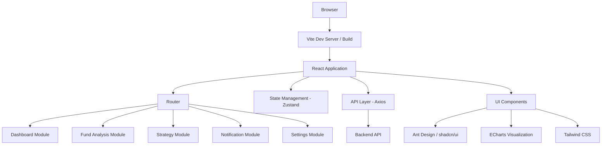

# Design Document

## Overview

FundPilot frontend is a React-based single-page application built with Vite that provides a comprehensive fund monitoring and analysis interface. The application follows a modular architecture with responsive design principles, utilizing modern web technologies to deliver real-time financial data visualization and AI-powered investment recommendations.

## Architecture

### High-Level Architecture



### Technology Stack

- **Build Tool**: Vite 5.x for fast development and optimized builds
- **Framework**: React 18 with TypeScript for type safety
- **Styling**: Tailwind CSS for utility-first styling
- **Component Library**: Ant Design for consistent UI components
- **Charts**: ECharts for interactive financial data visualization
- **State Management**: Zustand for lightweight global state
- **HTTP Client**: Axios for API communication
- **Routing**: React Router v6 for client-side navigation
- **Animation**: Framer Motion for smooth transitions

## Components and Interfaces

### Core Layout Structure

```typescript
interface AppLayout {
  header: HeaderComponent;
  sidebar: SidebarNavigation;
  main: RouterOutlet;
  footer?: FooterComponent;
}

interface HeaderComponent {
  logo: string;
  userProfile: UserMenu;
  notifications: NotificationBell;
  themeToggle: ThemeSwitch;
}

interface SidebarNavigation {
  menuItems: NavigationItem[];
  activeRoute: string;
  collapsed: boolean;
}
```

### Module Components

#### Dashboard Module
```typescript
interface DashboardProps {
  marketIndices: MarketIndex[];
  fundSummaries: FundSummary[];
  aiRecommendations: AIRecommendation[];
}

interface MarketIndexCard {
  name: string;
  value: number;
  change: number;
  changePercent: number;
  trend: 'up' | 'down' | 'neutral';
}

interface FundPerformanceChart {
  data: FundDataPoint[];
  timeRange: TimeRange;
  selectedFunds: string[];
  onTimeRangeChange: (range: TimeRange) => void;
}
```

#### Fund Analysis Module
```typescript
interface FundAnalysisProps {
  selectedFund: Fund | null;
  technicalIndicators: TechnicalIndicator[];
  historicalSignals: TradingSignal[];
}

interface FundSearchInput {
  onFundSelect: (fund: Fund) => void;
  placeholder: string;
  autoComplete: Fund[];
}

interface TechnicalChart {
  fundData: FundDataPoint[];
  indicators: ('MA' | 'RSI' | 'MACD')[];
  signals: TradingSignal[];
  timeRange: TimeRange;
}
```

#### Strategy Module
```typescript
interface StrategyTableProps {
  signals: TradingSignal[];
  filters: SignalFilters;
  onFilterChange: (filters: SignalFilters) => void;
  onExport: () => void;
}

interface SignalFilters {
  dateRange: [Date, Date];
  strategyTypes: string[];
  signalTypes: ('buy' | 'sell' | 'hold')[];
  minConfidence: number;
}
```

### API Interface Layer

```typescript
interface APIClient {
  funds: {
    getAll: () => Promise<Fund[]>;
    getById: (id: string) => Promise<FundDetail>;
    search: (query: string) => Promise<Fund[]>;
  };
  
  predictions: {
    getByFund: (fundCode: string) => Promise<AIPrediction>;
    getStrategies: () => Promise<TradingSignal[]>;
  };
  
  settings: {
    get: () => Promise<UserSettings>;
    update: (settings: UserSettings) => Promise<void>;
    testNotification: (config: NotificationConfig) => Promise<boolean>;
  };
}
```

## Data Models

### Core Data Types

```typescript
interface Fund {
  code: string;
  name: string;
  type: 'mixed' | 'index' | 'bond' | 'stock';
  currentValue: number;
  dailyChange: number;
  dailyChangePercent: number;
  lastUpdate: Date;
}

interface FundDataPoint {
  date: Date;
  value: number;
  volume?: number;
}

interface TechnicalIndicator {
  type: 'MA' | 'RSI' | 'MACD';
  values: number[];
  dates: Date[];
  parameters: Record<string, any>;
}

interface AIPrediction {
  fundCode: string;
  direction: 'up' | 'down' | 'neutral';
  confidence: number; // 0-1
  suggestion: 'buy' | 'sell' | 'hold';
  reason: string;
  validUntil: Date;
}

interface TradingSignal {
  id: string;
  fundCode: string;
  fundName: string;
  date: Date;
  strategyType: string;
  signalType: 'buy' | 'sell' | 'hold';
  confidence: number;
  recommendation: string;
  technicalReason: string;
}

interface UserSettings {
  theme: 'light' | 'dark';
  watchlist: string[]; // fund codes
  notifications: NotificationConfig;
  apiKeys: Record<string, string>;
  dataSync: 'local' | 'cloud';
}

interface NotificationConfig {
  enabled: boolean;
  channels: ('server酱' | 'email' | 'telegram')[];
  frequency: 'daily' | 'weekly' | 'realtime';
  schedule: string; // cron format
  credentials: Record<string, string>;
}
```

## Error Handling

### Error Boundary Strategy

```typescript
interface ErrorBoundaryState {
  hasError: boolean;
  error: Error | null;
  errorInfo: ErrorInfo | null;
}

// Global error boundary for unhandled errors
class GlobalErrorBoundary extends Component<Props, ErrorBoundaryState>

// Module-specific error boundaries for graceful degradation
class ModuleErrorBoundary extends Component<Props, ErrorBoundaryState>
```

### API Error Handling

```typescript
interface APIError {
  code: string;
  message: string;
  details?: any;
  timestamp: Date;
}

interface ErrorHandlingStrategy {
  networkErrors: RetryWithExponentialBackoff;
  authErrors: RedirectToLogin;
  validationErrors: ShowInlineMessages;
  serverErrors: ShowGlobalNotification;
}
```

### Loading States

```typescript
interface LoadingState {
  isLoading: boolean;
  loadingMessage?: string;
  progress?: number; // 0-100
}

// Component-level loading states
interface ComponentLoadingStates {
  dashboard: LoadingState;
  fundAnalysis: LoadingState;
  strategies: LoadingState;
  charts: LoadingState;
}
```

## Testing Strategy

### Unit Testing
- **Framework**: Vitest for fast unit testing
- **Coverage**: Minimum 80% code coverage for utility functions and hooks
- **Focus Areas**: 
  - Data transformation functions
  - Custom React hooks
  - API client methods
  - Validation logic

### Component Testing
- **Framework**: React Testing Library
- **Approach**: Test user interactions and component behavior
- **Coverage**: All major UI components and user flows
- **Mock Strategy**: Mock API calls and external dependencies

### Integration Testing
- **Scope**: Module-to-module interactions
- **API Integration**: Mock backend responses for consistent testing
- **State Management**: Test Zustand store interactions
- **Routing**: Test navigation and route guards

### E2E Testing (Optional)
- **Framework**: Playwright for critical user journeys
- **Scenarios**: 
  - Complete dashboard workflow
  - Fund analysis and signal generation
  - Settings configuration and persistence

### Performance Testing
- **Metrics**: 
  - First Contentful Paint < 1.5s
  - Largest Contentful Paint < 2.5s
  - Cumulative Layout Shift < 0.1
- **Tools**: Lighthouse CI for automated performance monitoring
- **Chart Performance**: Optimize ECharts rendering for large datasets

## Responsive Design Strategy

### Breakpoint System
```css
/* Tailwind CSS breakpoints */
sm: 640px   /* Mobile landscape */
md: 768px   /* Tablet portrait */
lg: 1024px  /* Tablet landscape / Small desktop */
xl: 1280px  /* Desktop */
2xl: 1536px /* Large desktop */
```

### Layout Adaptations
- **Mobile (< 768px)**: Single column layout, collapsible sidebar, simplified charts
- **Tablet (768px - 1024px)**: Two-column layout, drawer navigation, touch-optimized controls
- **Desktop (> 1024px)**: Multi-column layout, persistent sidebar, full feature set

### Component Responsiveness
- Charts: Responsive sizing with touch gestures on mobile
- Tables: Horizontal scrolling with sticky columns on mobile
- Forms: Stacked layout on mobile, inline on desktop
- Navigation: Hamburger menu on mobile, sidebar on desktop

## Performance Optimization

### Code Splitting
```typescript
// Route-based code splitting
const Dashboard = lazy(() => import('./modules/Dashboard'));
const FundAnalysis = lazy(() => import('./modules/FundAnalysis'));
const Strategy = lazy(() => import('./modules/Strategy'));
```

### Data Optimization
- **Caching**: Implement React Query for server state caching
- **Pagination**: Implement virtual scrolling for large datasets
- **Chart Optimization**: Use ECharts data sampling for large time series
- **Image Optimization**: Lazy loading and WebP format support

### Bundle Optimization
- **Tree Shaking**: Remove unused code from final bundle
- **Chunk Splitting**: Separate vendor and application code
- **Compression**: Enable Gzip/Brotli compression
- **CDN**: Serve static assets from CDN

This design provides a solid foundation for building the FundPilot frontend application with modern React practices, comprehensive error handling, and performance optimization strategies.